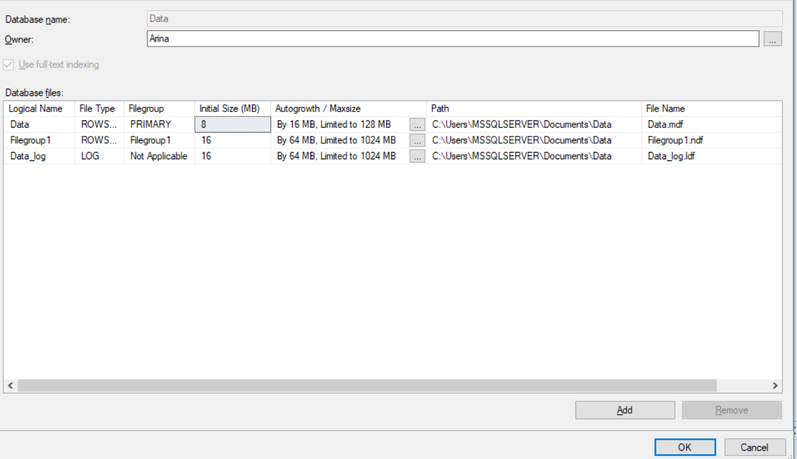
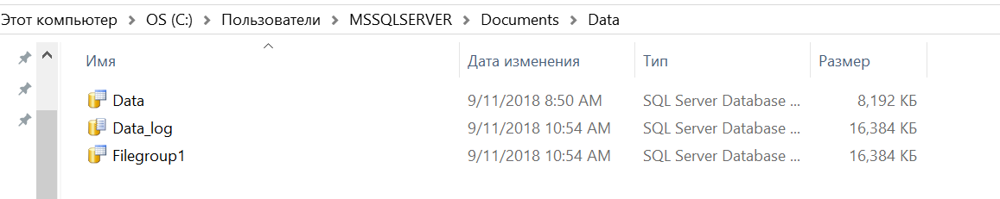
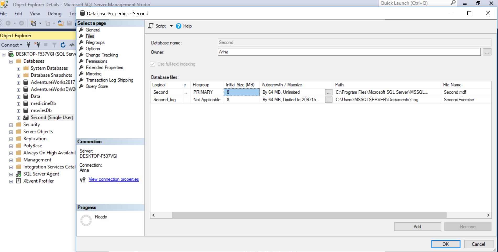
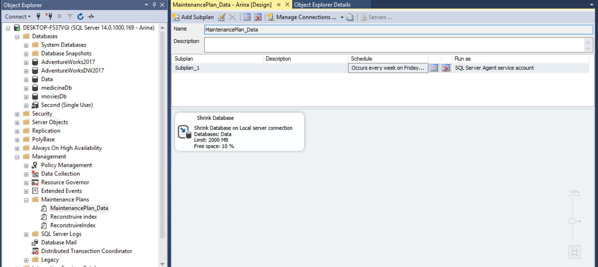
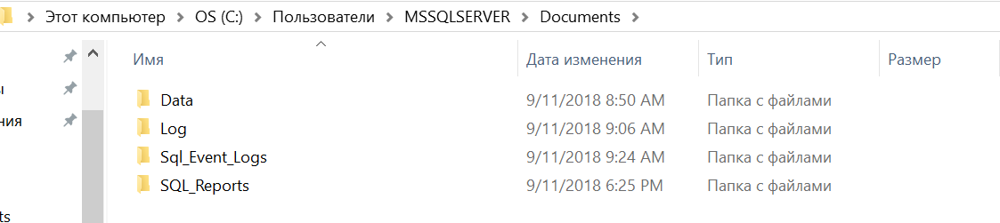
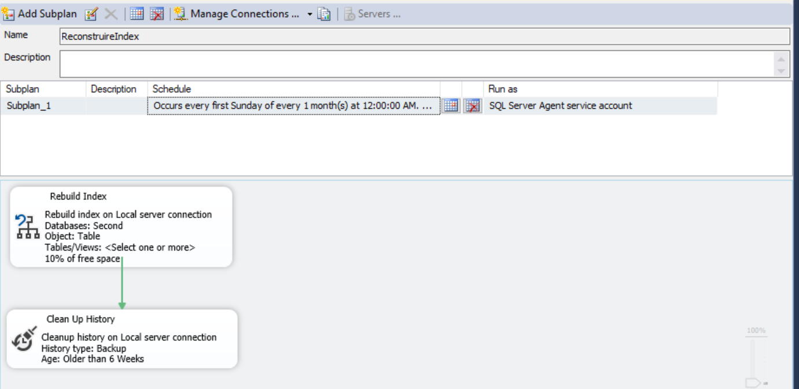
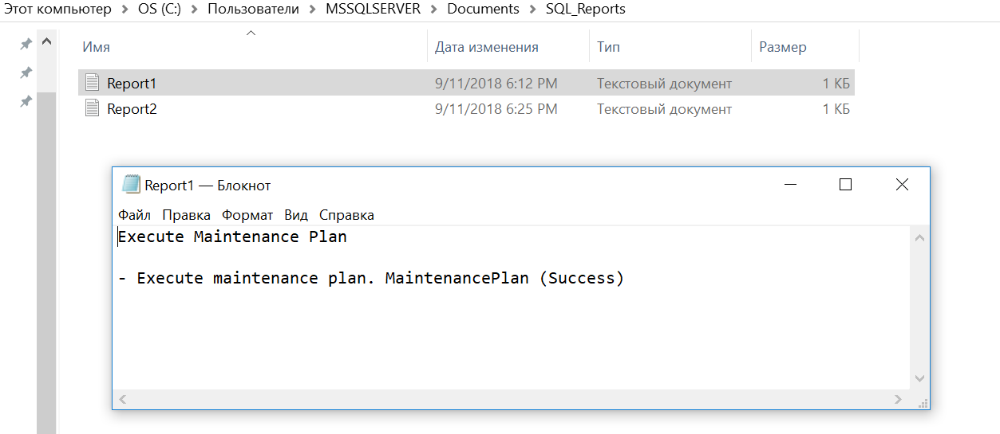

# Laboratory Work nr.1
## Theory
### File types used in Microsoft SQL Server
SQL Server DataBase contains 3 types of file:
1. Primary Files - contains the startup information for the database and points to the other files in the database. User data and objects can be saved in this file or in secondary data file. Every database have only one primary file and for this type of files is recommended the .mdf extension

2. Secondary Files - this type of files is optional, user defined and stores user data.It can be used to spread data across multiple disks by putting each file on a different disk drive.Additionally, if a database exceeds the maximum size for a single Windows file, you can use secondary data files so the database can continue to grow. The recommended file name extension is .ndf

3. Log Files - The transaction log files hold the log information that is used to recover the database. There must be at least one log file for each database. The recommended file name extension for transaction logs is .ldf.

### Structure of  a Data Page 
Pages in a SQL Server data file are numbered sequentially, starting with zero (0) for the first page in the file. Each file in a database has a unique file ID number. To uniquely identify a page in a database, both the file ID and the page number are required. 
The first page in each file is a file header page that contains information about the file attributes. Several of the other pages at the start of the file also contain system information, such as allocation maps. One of the system pages stored in both the primary data file and the first log file is a database boot page that contains information about the attributes of the database.
In MSSQL page size is 8Kb, it means that a database contains 128 pages/ Mb. 
A page contains:
1. Page header (96 bytes) and contains information such as: page number, its type, ID number etc.
2. Page Body - Data rows are put on the page serially, starting immediately after the header.

### System Data Base. Importance and its role
MSSQL includes 5 system databases: 
1. Master database - Records all the system-level information for an instance of SQL Server.
2. msdb Database - Is used by SQL Server Agent for scheduling alerts and jobs.It makes possible to determine when each database and filegroup was last backed up
3. model Database - Is used as the template for all databases created on the instance of SQL Server. 
4. Resource Database - Is a read-only database that contains system objects that are included with SQL Server.It is designed to make it easy for quick database upgrades
5. tempdb Database - Is a workspace for holding temporary objects or intermediate result sets. It is vital for effective SQL Server performance

These databases are used by SQL Server for its own maintenance and management.

### Principles of creating a database in MSSQL
In order to create a database we should make a click with mouse right button on database option and choose new database, then we should specify  the database name then we can modify and add some database files and specify the maximum size for them, the autogrowth propery ,physical path  and other parameters. Then in options tab we can specify some additional parameters, such as compatibility user, we can restrict the access for example to only one user at a time etc.

### What is a data base Maintenance and the tehniques of elaboration.
Maintenance plans create a workflow of the tasks required to make sure that your database is optimized, regularly backed up, 
and free of inconsistencies.
We can create a maintenance plan by  using:
1.Maintenance Plan Wizard - creates core maintenance plans,
2.Manually creation - that gives you more flexibility

## Exercise 1
In exercise 1 was created a simple database were was setted up the autogrowth/maximize property, physical file path, and also another
filegroup was made.

And I saved it in Documents/Data folder as is shown below:

## Exercise 2
Another database was created named Secondary and in the option tab was setted up the option that allow only one user at a time to access the database.

The Log filed was saved in the directory Documents/Log

## Exercise 3
Here a maintenance plan was made  for my first database that shrink the database when its size is 2000 Mb. Thereleased space is returned 
to the operating system. This process starts every friday at 00:00.

According to our condition the execution report is saved to SQL_Event_Logs folder.

## Exercise 4
In this exercise a maintenance plan for the second database was made and it used History Cleanup Task and Rebuild Index Task with all the settings as specified in condition: 

Reports are saved in the respective physical location shown below.

