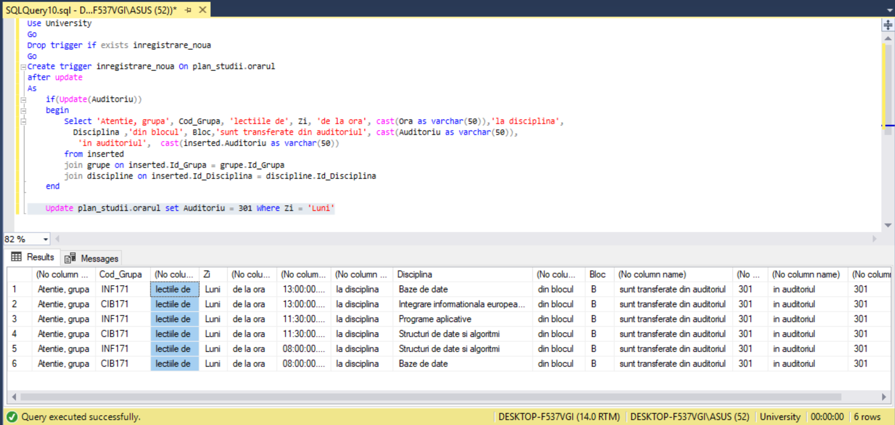
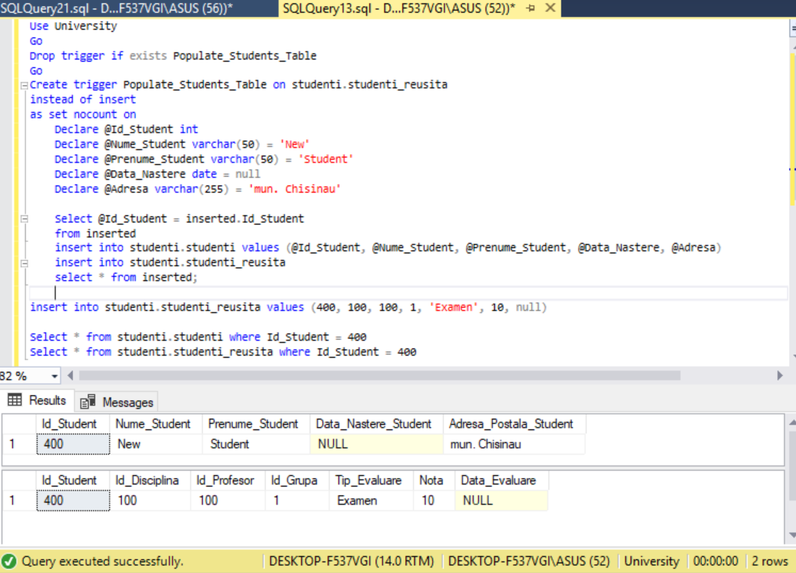
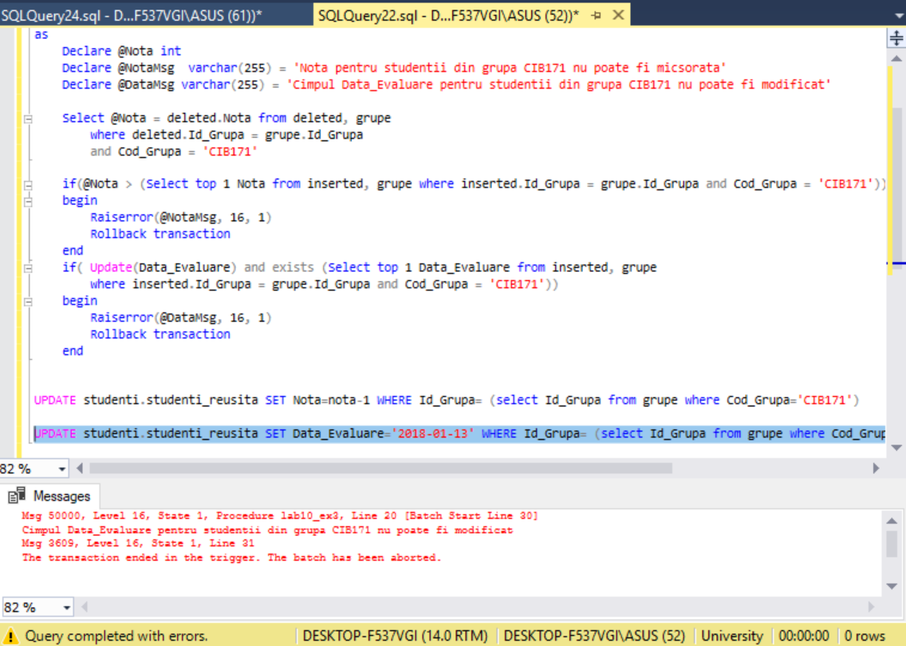
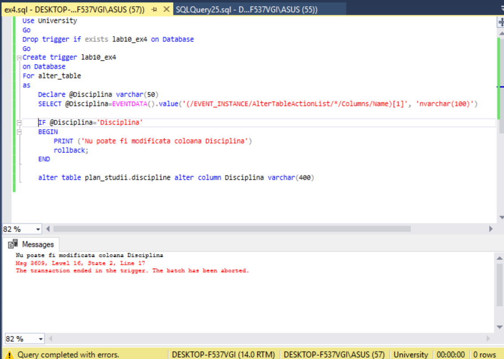
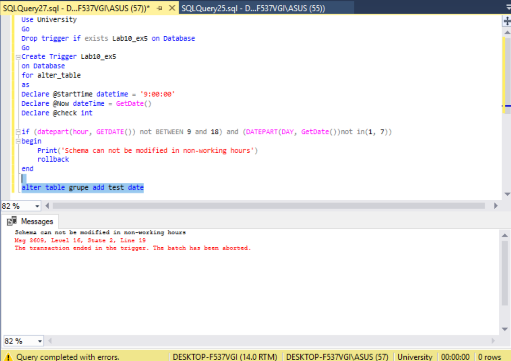
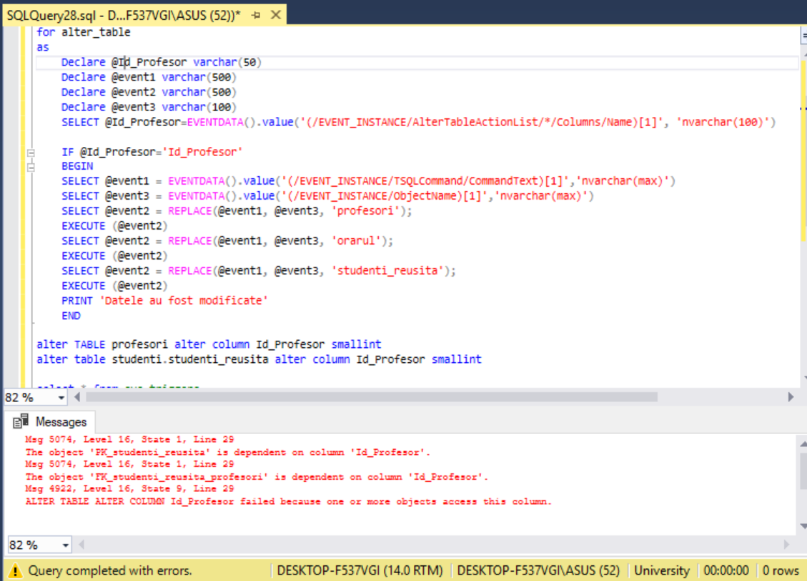

# Laboratory work nr.9
## Stored procedures and user defined function

## Exercise 1 
Create stored procedures based on exercises(2 exercises) from Chapter 4. Entry parameters must correspond to criteria from Where Clause

## Exercise 2
Create a stored procedure, without any entry parameter and has the output parameter. Output parameter must return the number of students, 
who do not pass at least one form of evaluation( the mark is less than 5 or is NULL).

## Exercise 3
Create a stored procedure, which will insert in the database data about new student. Entry parameters must be new data about student and 'Cod_Grupa'. 
Generate the all needed keys in studenti_reusita table. Marks must be NULL.

## Exercise 4
Create a stored procedure which will update records in the 'studenti_reusita' table to the new 'profesor'. Entry parameters must be: numele and prenumele 
of the old teacher, numele and prenumele of the newest teacher, discipline. In case of entering of wronga should appear a error.
  

## Exercise 5
Create a stored procedure which will form a list of the best 3 students at the any discipline, for this students must increase 
the mark with one unit. Entry parameters: discipline. Procedure should returns : Cod_Grupa, Name_Surname,Discipline, Old_Mark, New_Mark.
 
 
 ## Exercise 6 
Create defined functions by user based on exercises(2 exercises) from Chapter 4. Entry parameters must correspond to the Where Clause.

## Exercise 7
Create a function which will calculate how old is the given student. The defined format of function: <name_function>(<Data_Nastere_Student>).

## Exercise 8
Create a function defined by user, which will returns the data based on student. The defined format: <name_function>(<Name_Surname_Student>). 
Show the table with the following fields: Name_Surname_Student,Discipline,Mark,Date of evaluation.

