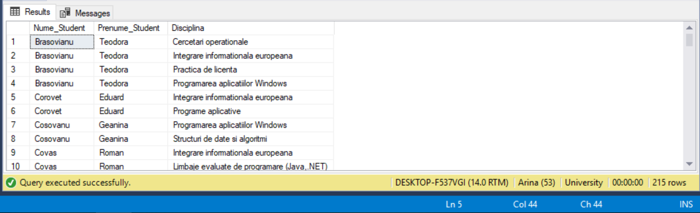
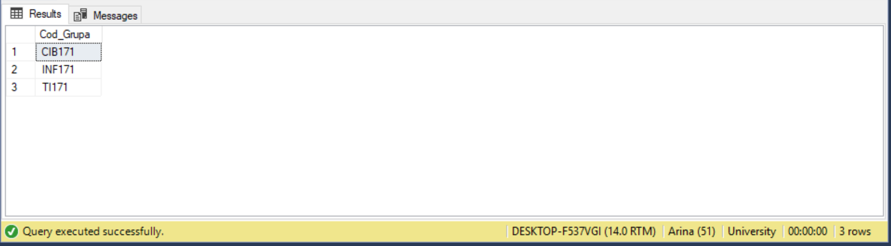
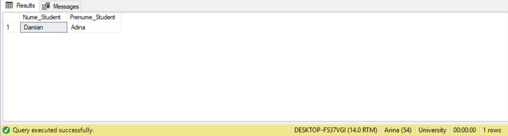
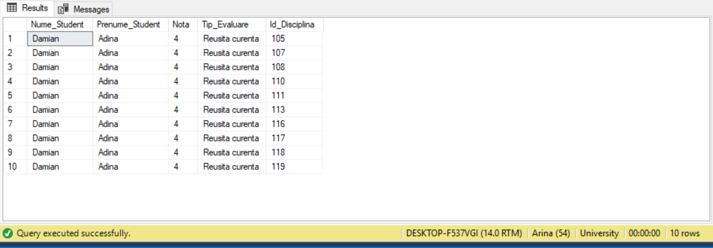

# Laboratory Work nr.4

## Exercise 1(14)
Display the name and surname of the students, as well as the promoted courses where they get marks higher than 8  
In this exercise first of all I  joined the tables, according to student and course ids, then I select only the students that have got a mark higher than 8 at exam using the WHERE clause and the result is shown in the image below.

## Exercise 2(25)
Display the study groups(Cod_Grupa) that consists of more than 24 students. 
In this exercise I made a subquery that group all tuples  by group Id and count the students, finally only the study groups with 25 students was selected.

## Exercise 3(33)
Display the name and surname of the students that get only negative marks at "reusita curenta" at all courses 
(PS In our database we don't have a student that satisfy the previously mentioned condition, so I changed the marks of the student with id 
104, in order to verify the query result) 
In this exercise, first of all in a subquery, the students with test type "reusita curenta" and marks higher than 5 are selected, than  after joining the "studenti" and "studenti_reusita" tables, the students which ids is not equal with any id that was returned by the subquery are selected and their names and surnames are displayed. The result is shown below:

So in order to prove that the query is correct, I changed a little the query from ex3, in order to show that at all disciplines this student has a negative mark:

## Conclusion

During this laboratory work, we gained the necessary knowledge of working with queries and subqueries, also we applied in practice the information we learned about joins and noticed how they really work. Finally, I understand that subqueries are very useful, since they structure the query and performs the operations that would require unions and multiple joins. Most subqueries can be written as joins and vice versa. Compared to subqueries, joins are faster, but they are more confusing and are harder to read.
