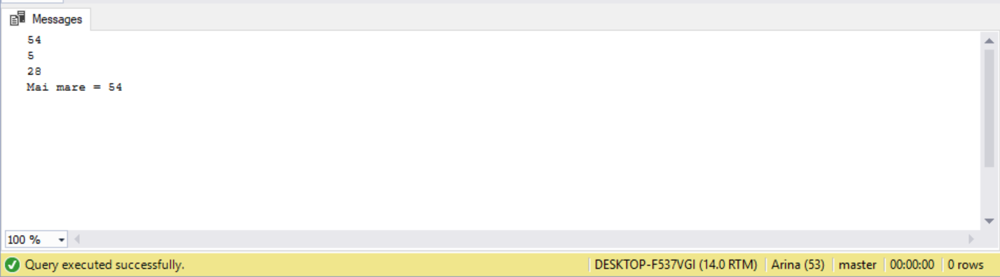
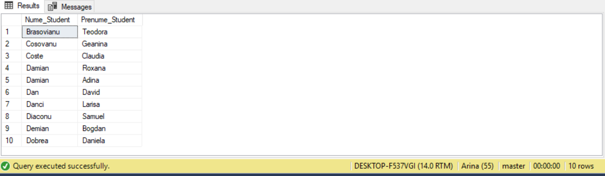
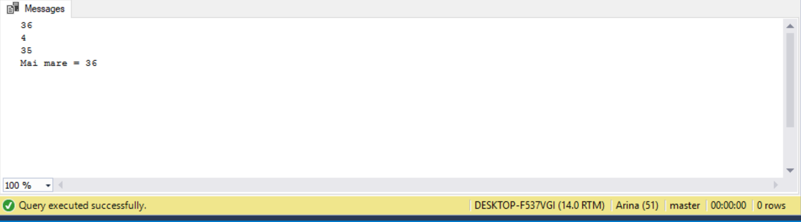
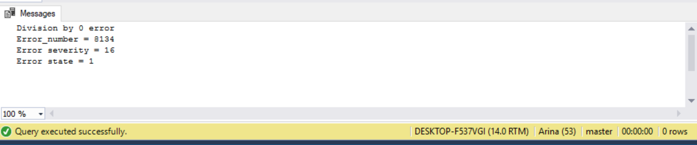

# Laboratory work nr.5
## Transact-SQL. Procedural instructions

## Exercise 1 
Complete the code below in the way it will print the biggest number. 
In this exercise I added to the given piece of code  the corresponding condition using if...else statement.

## Exercise 2
Display the first 10 students(name and surname), depending on student marks(except the students who have got 6 and 8) at first test at 
'Data base' discipline using if...else statement. Use variables.
In this exercise, I used IIF logical function that evaluates the students marks, so that the tuples where mark is 6 or 8 will be excluded.
So, knowing that the structure of IIF is : IIF ( boolean_expression, true_value, false_value ), we evaluate all students against their
marks.

## Exercise 3
Solve the  exercise 1 using CASE.

The result is the same as in exercise 1.

## Exercise 4
Modify the exercises 1 and 2, include error processing: try, catch and raiserror 
In this exercise in case of our exercise nr.1 , I included division by 0 and i catch that erro, in the second exercise i put the try and cattch blocks 
and if there are less than 10 students, the error is raised.

## Conclusion
During this laboratory work, We gain some knowledge in using Transact-SQL, we learned how to use if-else statement, key, while,try-catch,
raiseror, waitFor, etc

