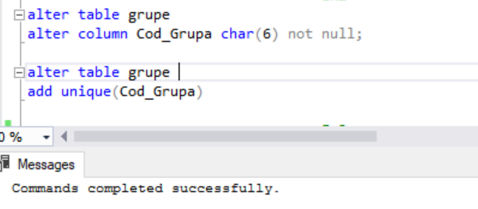
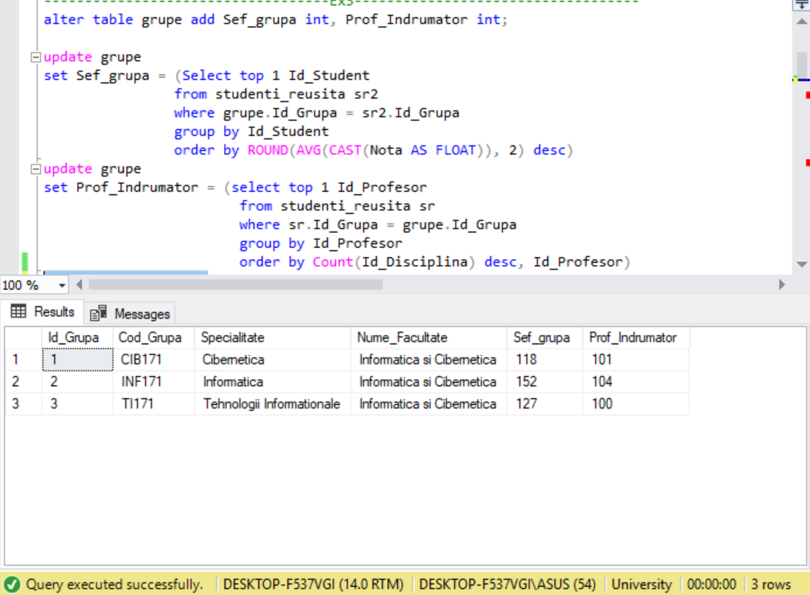
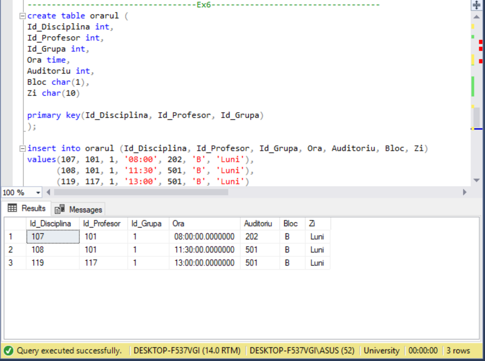

# Laboratory work nr.6
## Tables and Indexes

## Exercise 1 
Write a T-Sql instruction, that will populate the column "Adresa _ Postala _ Profesor" from table "profesori" with value "mun.Chisinau",
where the column value is NULL

## Exercise 2
Modify the table named "grupe" according to the following conditions:
  1. "Cod_Grupa" field should accept unique values and should not accept unknown values
  2. Take in consideration that the primary key is already defined on *Id_Group* column

## Exercise 3
Add 2 columns: *Sef_Grupa* ; *Prof_Indrumator* of type Int, to the table named *grupe*. Populate the given column fields with values according to the following
criteria:
1. *Seful_grupei* should have the best average mark from his group  on all disciplines and all types of evaluation.
2. *Prof_Indrumator* column should teach a maximum number of disciplines for this group. If there are more candidates that correspond to 
this conditions, then get the teacher with the minimal Id from the teachers that correspond to the previous criteria. The values inthis columns should be unique
3. Write ALTER, INSERT, UPDATE instruction, necessary for creating the given fields, for selecting the corresponding candidates and  data insertion.

The result is the same as in exercise 1.

## Exercise 4
Write a T-SQL instruction, that will increase the marks of all group-leads with one point 
  

## Exercise 5
Create a table named "profesori_new", with columns: **Id_Profesor**, **Nume_Profesor**, **Prenume_Profesor**, **Localitate**, **Adresa_1**, 
**Adresa_2**
1. *Id_Profesor* - primary key, CLUSTERED
2. *Localitate* - have default value *mun.Chisinau*
3. Insert data from table "profesori" to the new table, according to the followingmapping rules:
 ⋅⋅1. Id_Profesor = Id_Profesor
 ⋅⋅2. Nume_Profesor = Nume_Profesor
 ⋅⋅3. Prenume_Profesor = Prenume_Profesor
 ⋅⋅4. Adresa_Postala_Profesor = Localitate
 ⋅⋅5. Adresa_Postala_Profesor = Adresa_1 (street)
 ⋅⋅6. Adresa_Postala_Profesor = Adresa_2 (house number)
 
 
 ## Exercise 6 
 Insert the next data in "orar" table, for the group CIB171, with Id_Group = 1, for Monday. All lessons will take place in studies block 'B' 
(ld_Disciplina = 107, Id_Profesor= 101, Ora ='08:00', Auditoriu = 202);  
(Id_Disciplina = 108, Id_Profesor= 101, Ora ='11:30', Auditoriu = 501); 
(ld_Disciplina = 119, Id_Profesor= 117, Ora ='13:00', Auditoriu = 501); 

## Exercise 7 
Write T-SQL instructions  neccessary for populating the "orar" table for INF171 group, for Monday. The data to be inserted should be collected from the database tables
lectie #1 (Ora ='08:00', Disciplina = 'Structuri de date si algoritmi', Prof esor ='Bivol Ion') 
lectie #2 (Ora ='11 :30', Disciplina = 'Programe aplicative', Profesor ='Mircea Sorin') 
lectie #3 (Ora ='13:00', Disciplina ='Baze de date', Profesor = 'Micu Elena') 

## Exercise 8
Write the queries necessary for creating te indexes  on tables from "University" database to ensure a higher performance to the queries from laboratory 
work number 4. Analyse the results. 
The indexes must be physically placed into **userdatafgroup** file group 

