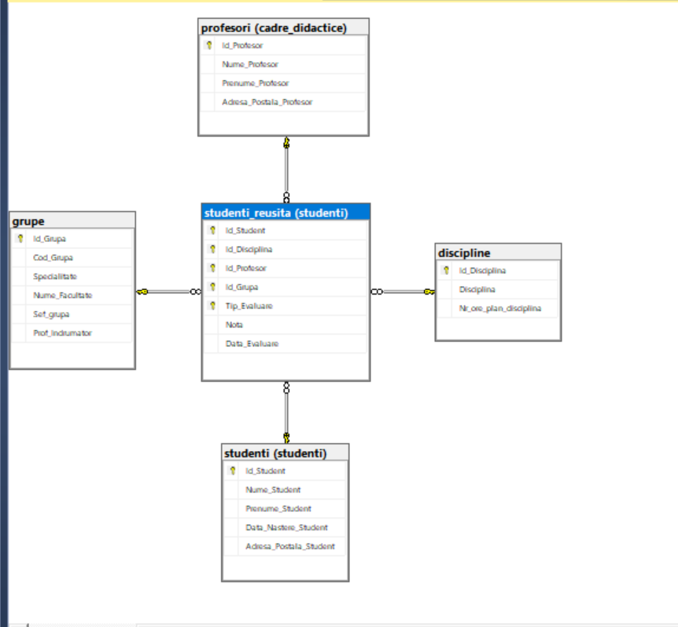
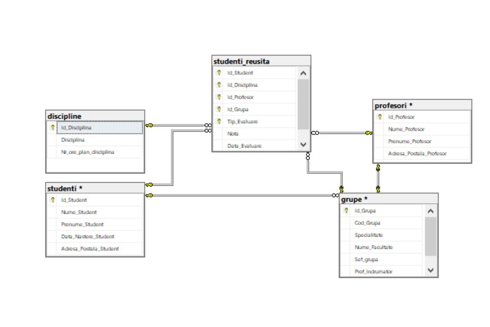
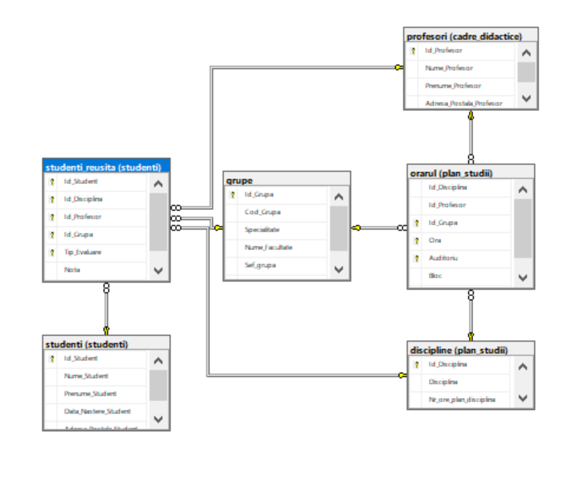
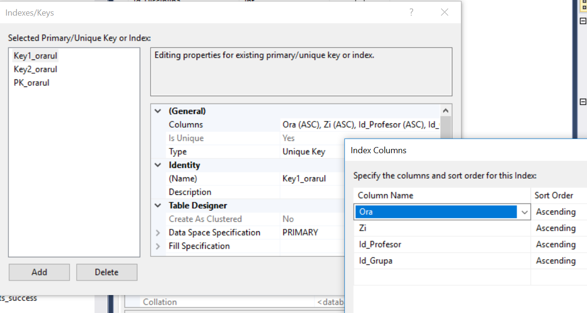
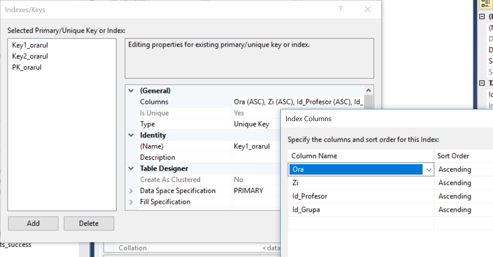
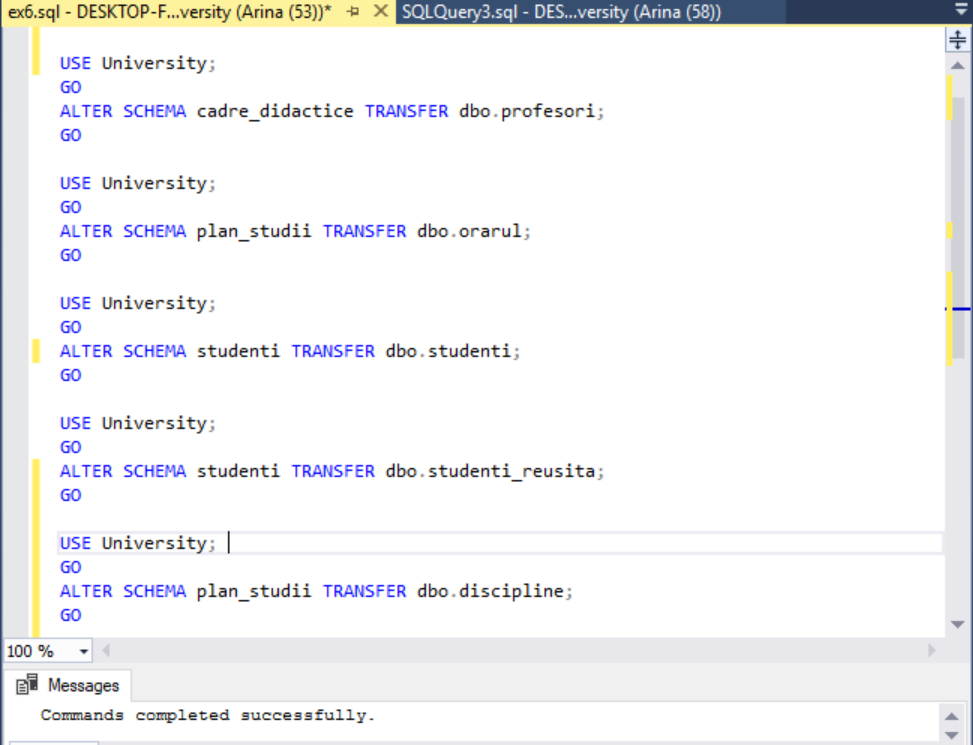
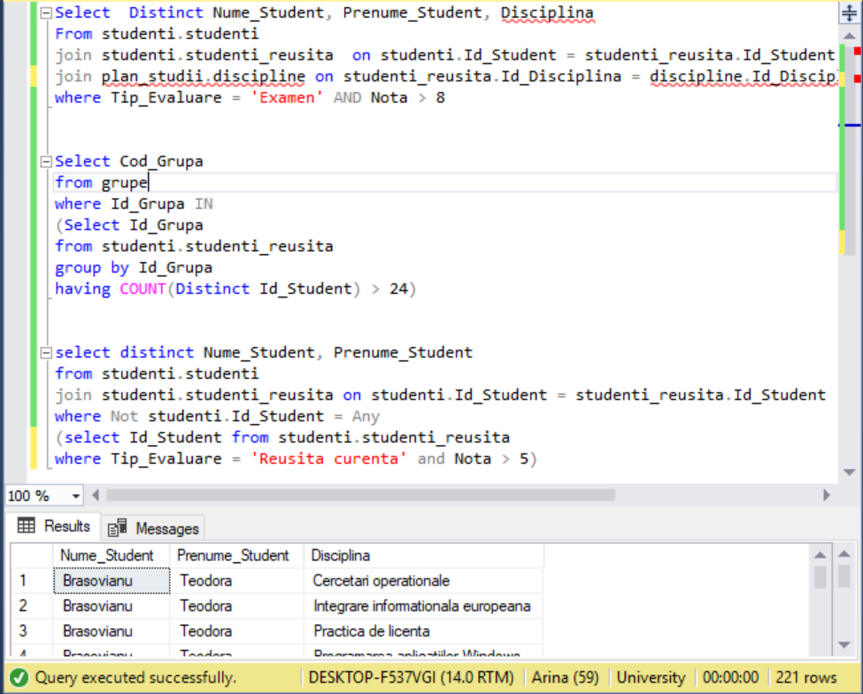
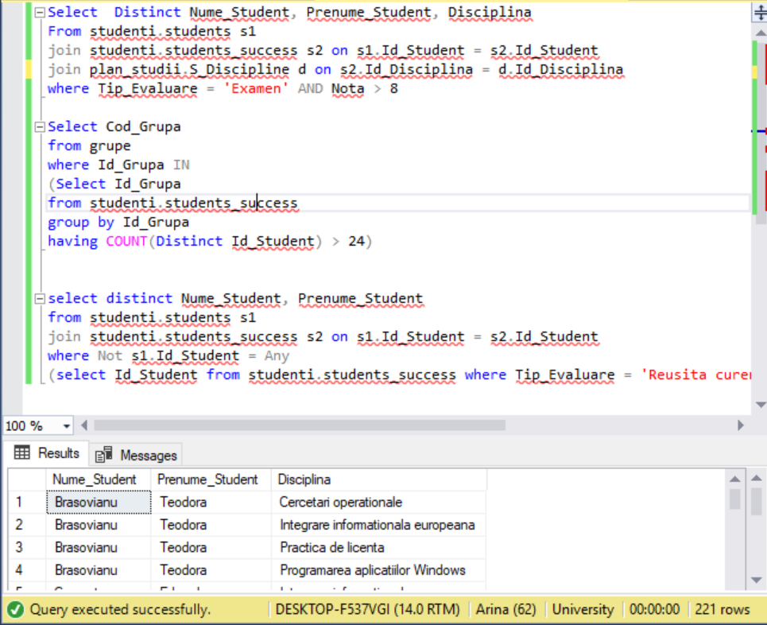

# Laboratory work nr.7
## Diagrams, schemas and synonyms

## Exercise 1 
Create the diagram of university database, that will include the following tables: *Profesori*, *Studenti*, *Studenti_reusita*, *Grupe*, 
*Discipline*

## Exercise 2
Add the referential constraints with tables *studenti* and *profesori* for columns *Sef_grupa* and *Prof_indrumator* from table *grupe*   

## Exercise 3
Add 2 columns: *Sef_Grupa* ; *Prof_Indrumator* of type Int, to the table named *grupe*. Populate the given column fields with values according to the following
criteria:
1. *Seful_grupei* should have the best average mark from his group  on all disciplines and all types of evaluation.
2. *Prof_Indrumator* column should teach a maximum number of disciplines for this group. If there are more candidates that correspond to 
this conditions, then get the teacher with the minimal Id from the teachers that correspond to the previous criteria. The values inthis columns should be unique
3. Add to the existing diagram from ex1, another table from your database: *orarul*

## Exercise 4
The table should contain 2 secondar keys:(Zi,Ora, Id_Grupa, Id_Profesor) and (Zi, Ora , Id_Grupa, Id_Disciplina)
  
  

## Exercise 5
In the diagram also should be shown  the constraints (FK-PK) for atributes: Id_Disciplina, Id_Profesor and Id_Grupa between table *orarul* 
and tables *discipline*, *profesori* and *grupe* .(In the ex3 , I have already indicated those constraints)
 
 
 ## Exercise 6 
 Add in the database 3 new schemas and change the schemas of the tables between parentheses from dbo to the corresponding one:
 *cadre_didactice*(profesori), *plan_studii*(orarul, discipline) and *studenti*(studenti, studenti_reusita)

## Exercise 7 
Modify 2-3 queries from laboratory nr.4, taking in considerations that table's schemas were changed

## Exercise 8
Create synonyms in order to simplify the queries from the previous exercise.

