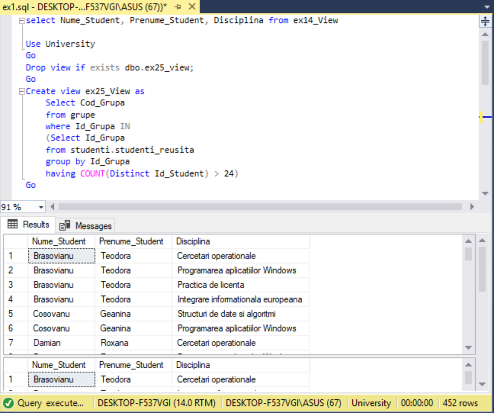
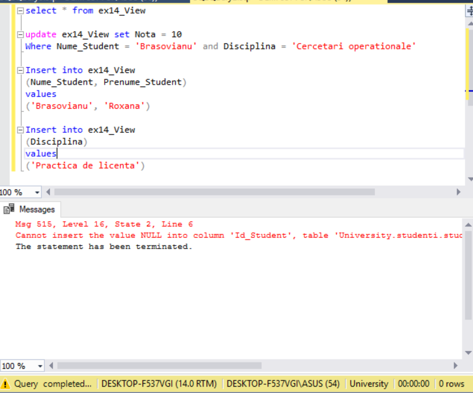
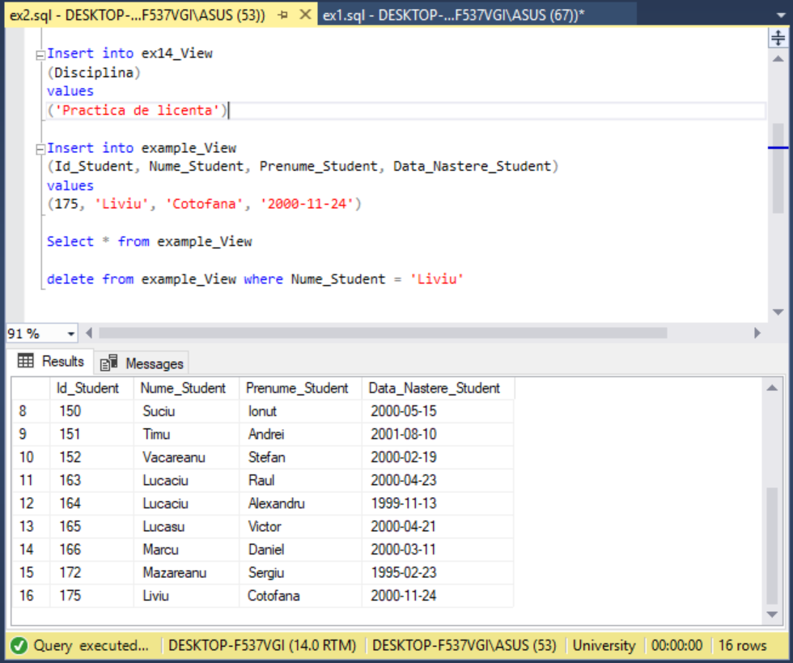
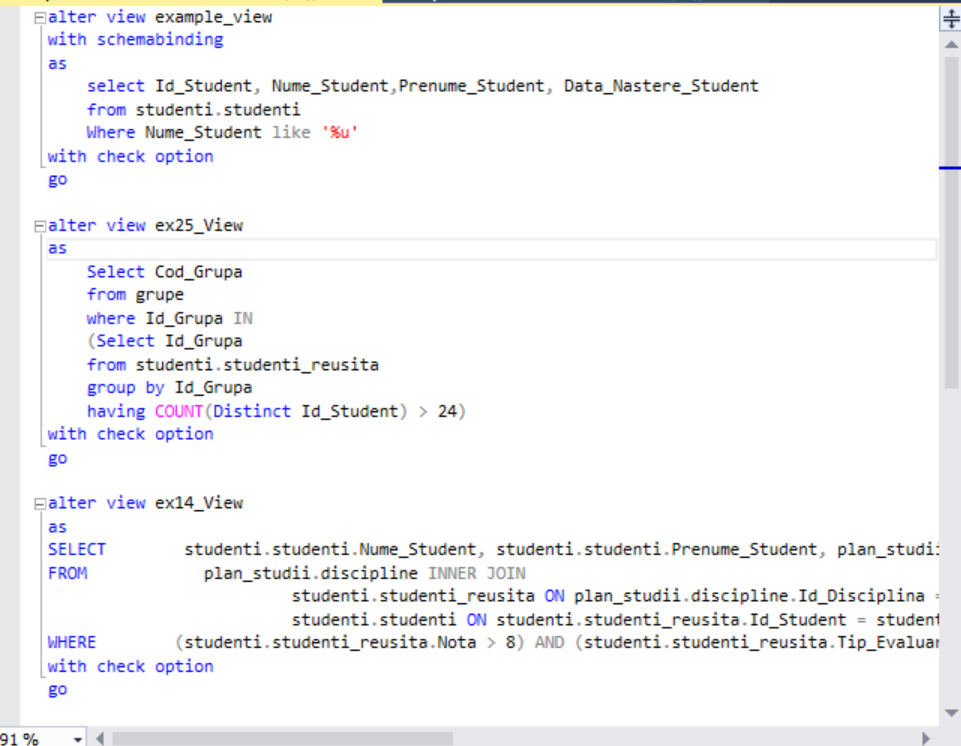
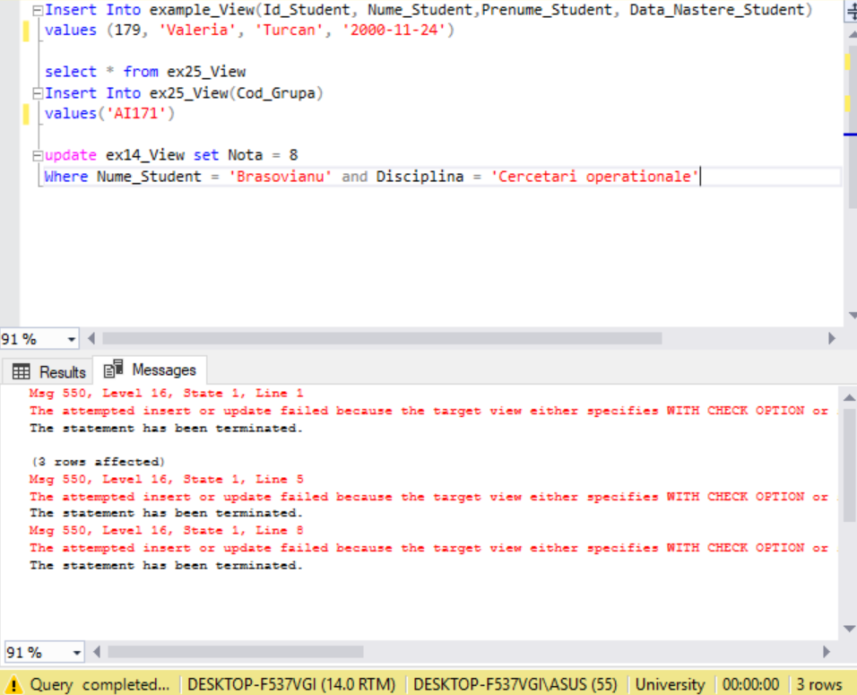
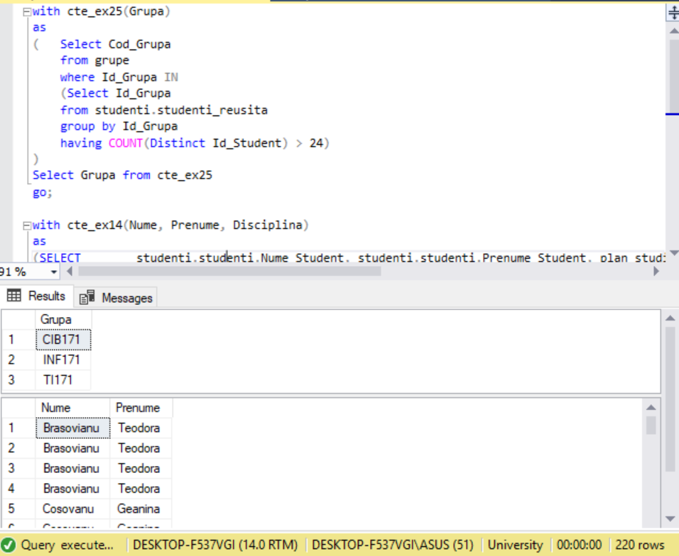
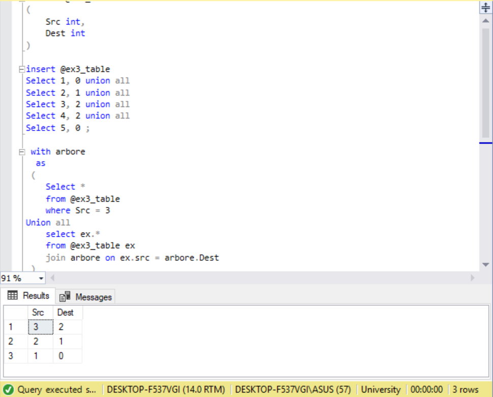

# Laboratory work nr.8
## Views and Common Table Expressions 

## Exercise 1 
Create 2 views based on queries formulated in chapter 4. The first view needs to be build in the query editor and the second one using 
View Designer.

## Exercise 2
Write an example of instructions INSERT, UPDATE, DELETE on the created views. Add the necessary comments referring to the results
of these instructions.

 

## Exercise 3
Write SQL instructions which would modify the created views (from exercise 1) so that, the modification or deletion of the tables which 
these are defined on is not possible and the views should not accept DML operations, if the conditions of clause WHERE is not satisfied.

## Exercise 4
Write instructions to test the defined properties.
  

## Exercise 5
Write 2 queries formulated in chapter 4 so that, the subqueries are represented under CTE expressions.
 
 
 ## Exercise 6 
Consider an orieted graph like the one in the figure below and should be passed the way from node id = 3 to node id = 0. Make the orieted graph represetation under recursive table-expresion form. 
Observe the instruction after UNION ALL of the recursiv member, as well as the part before UNION ALL, represented by the hook-member.

