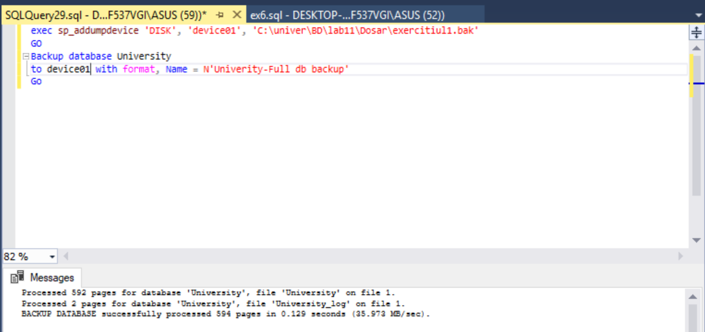
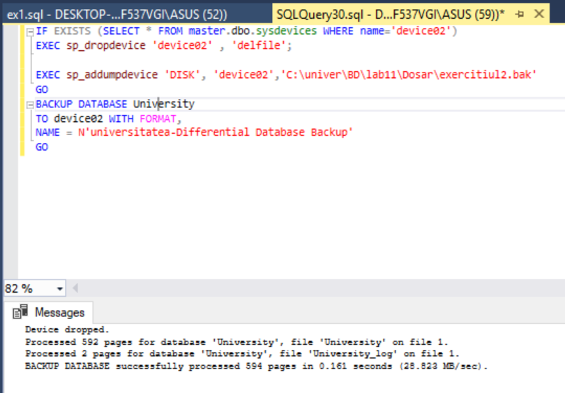
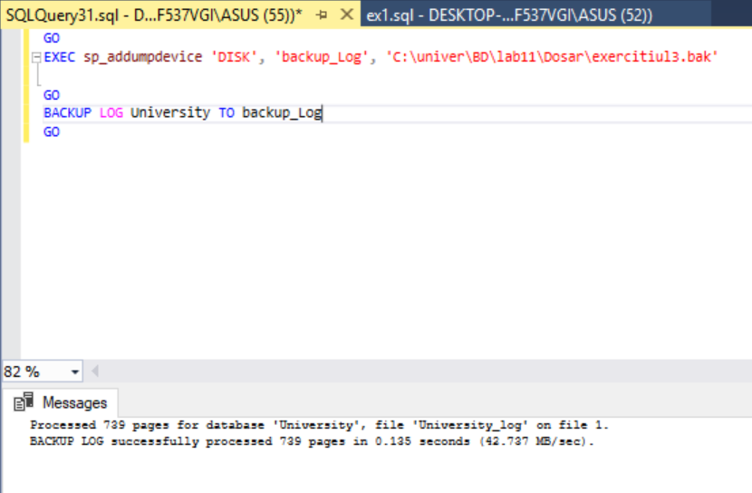
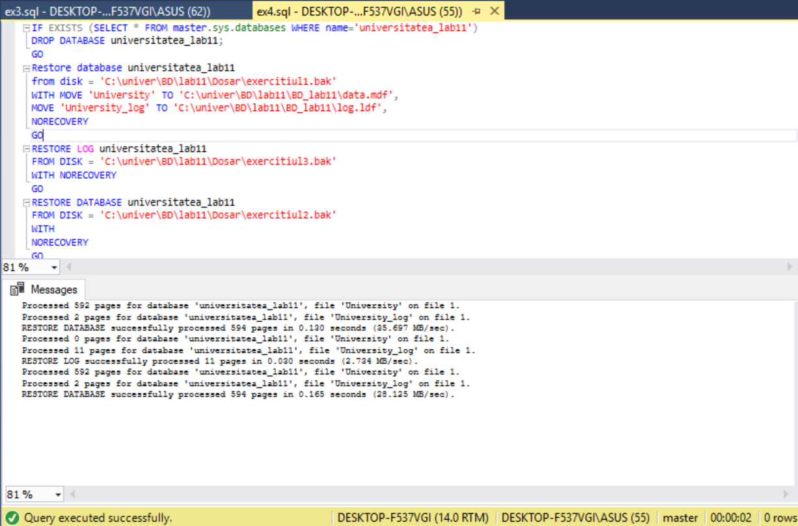
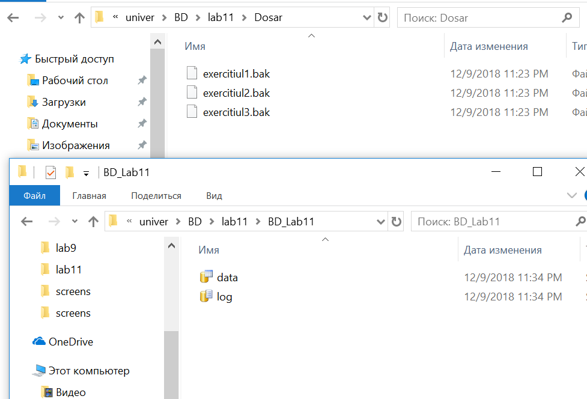

# Laboratory work nr.11
## Database restore

## Exercise 1 
Create a folder 'Backup_lab11'. Execute a full backup of database 'universitatea' in this folder. File of restoring must be named exercitiul.bak. Execute SQL instructions.

## Exercise 2
Create a stored procedure, without any entry paramWrite SQL instructions for differential backup which will be named exercitiul2.bak.

## Exercise 3
Write SQL instructions for log backup whici will be named exercitiul3.bak.

## Exercise 4
Execute restoring consecutively of all backup files created. The new databse will be named universitatea_lab11. Files of the new database must be located in 'BD_lab11'. Write the SQL instructions.

